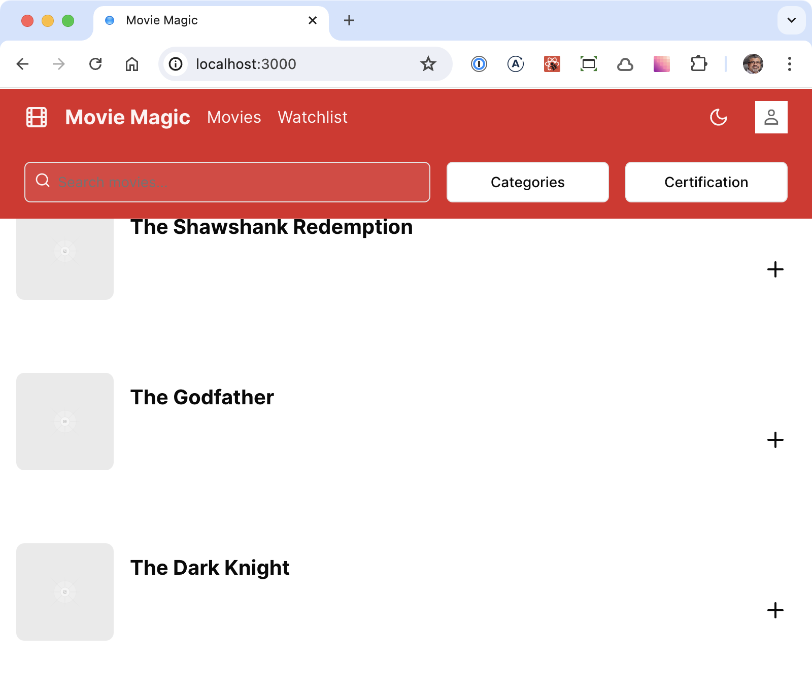
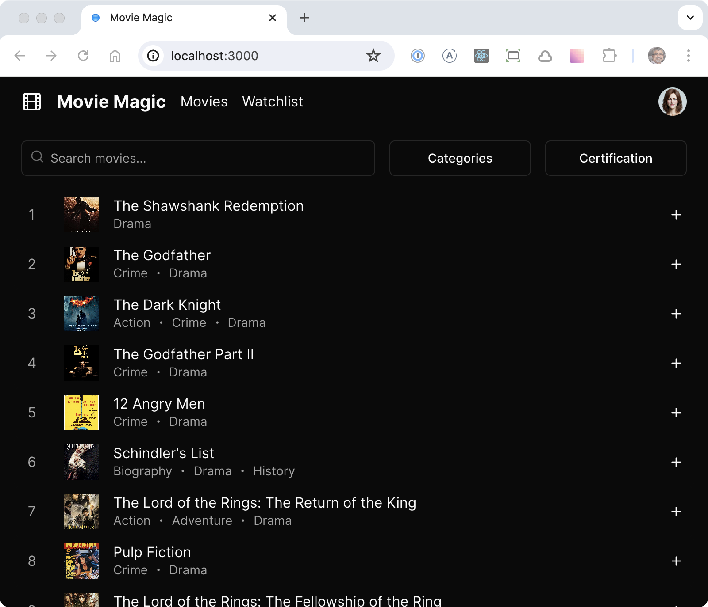

# Movie Magic v0

Movie Magic v0 is an implementation of a movie streaming app generated by
[v0](https://v0.dev/). I show the raw implementation as generated by v0,
followed by a series of manual steps to bring it to a reasonable state as a
human might code it.

## Prompt used for app generation

Write a movie streaming application called "Movie Magic".

The application should support light and dark mode, with dark mode as the
default.

The theme of the application should be red, This means that when you need to use
accent colors for buttons etc., use red.

The application should consists of the following components from top to bottom.

1. Application header: 56 pixels tall, divided into left and right sections.
   Left section consists of following components from left to right: Logo (a
   film icon), application name ("Movie Magic"), navigation menu with 2 links
   ("Movies" & "Watchlist"). The right section consists of 2 components that are
   right justified, and they are (from left to right): (a) light/dark mode
   toggle, (b) user's avatar.
2. Movie filters: Three movie filters all in one row: (a) Search input, (b)
   "Categories" dropdown, (c) "Certification" dropdown
3. Movie List: 1 movie per row. Each row contains the movie image, name and a
   plus icon to add the movie to the watchlist

There is no need to implement authentication.

Use mock data for movies.

## Commits

### commit-1

Add `MoviesPage` generated by v0 using `npx v0 add EVnMtQzNao1`. This simply
adds the generated page at `/components/movies-page.tsx`. It is not connected to
anything and hence does not display in the UI.

### commit-2

Move the generated `MoviesPage` from `/components/movies-page.tsx` to
`/app/page.tsx` so that it gets displayed in the UI.


### commit-3

Add prettier and format all files.

### commit-4

Miscellaneous cleanup:

1. `global.css`: Replace theme with red (although prompt instructed to use red
   theme)
2. `layout.tsx`: Change font setup as I like it, replace default metadata with
   app specific metadata
3. `tailwind.config.ts`: Format + add font setup as I like it.

This changed the app header to red – totally unexpected!



### commit-5

1. Removed light/dark mode toggle because it was adding the `dark` class to the
   page's `<div>` instead of the `<html>` element of the document.
2. Fixed mode to dark
3. Removed primary color (red) from the header and filters.


### commit-6

1. Added mock movie data
2. Refine movie list styling
3. Fixed issue with tailwind.config.ts where shadcn configuration was overriding
   the default tailwind configuration instead of extending it.



## Development Build

```shell
npm ci
npm run dev
```

Now point your browser to http://localhost:3000
